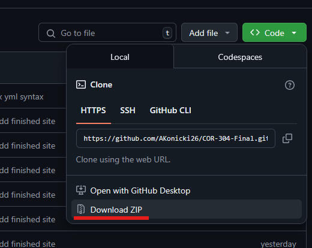

# COR 304 Final Project

This document will take you through the installation and running of the project.
The Final Project wiki exists on a web-server locally hosted on your machine to allow
for smooth page navigation.

The web-server will by default run on localhost:8080.
It is important that no other processes be running on this port beforehand.
If you are unsure if any processes are currently running on port 8080, they are not.

Running the webserver has not been tested on operating systems other than Windows.
If you are using a different operating system, there may not be support to running the project web-server.

---

## Download

To start, download the project as a zip file from either the clone or releases sections:

Extract the .zip folder downloaded.

---

## Installing Dependencies

There are two methods of installing dependencies, automatic and manual.

### Automated Download (Windows only)

To download the dependencies automatically and start the web-server, run the `install.ps1` script
within the root of the project __as administrator.__ 
The dotnet 8.0 download will not succeed if you do not run the installation file as administrator.

Running the install file will download the dotnet 8.0 runtime, the dotnet tool docfx, and start the webserver.

### Manual Download

Go to the [dotnet 8.0 installation](https://dotnet.microsoft.com/en-us/download/dotnet/8.0) website.
Download the version of dotnet according to your current operating system.

Follow the installation instructions per your machine.

Open a terminal in the root of the extracted folder and run the command `dotnet tool -g update docfx`. 
Docfx will then install itself globally on your machine.

After the install, run the command `docfx --serve`. 
This will run the web-server on your machine.

---

## Accessing Website

To open the website, open http://localhost:8080. 
This will bring you to the main introduction page. 
To access the rest of the content, click "The World" in the top navigation bar, or click the "The World" link at
the bottom of the page.