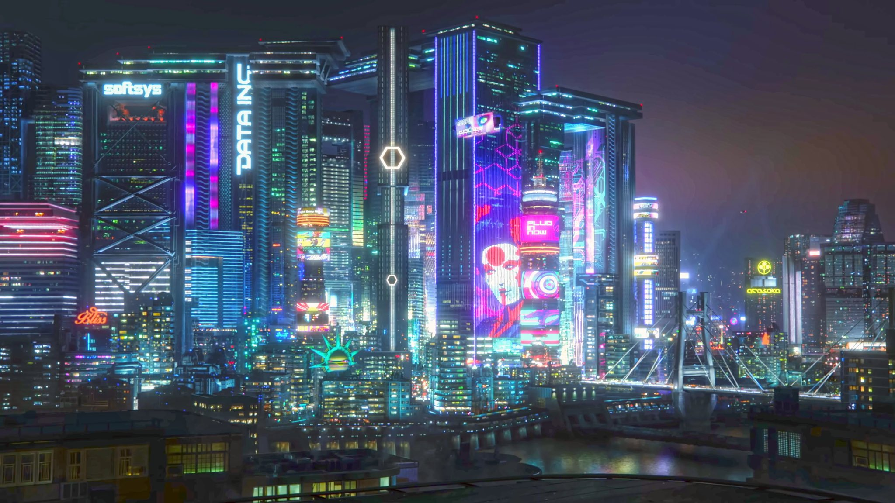
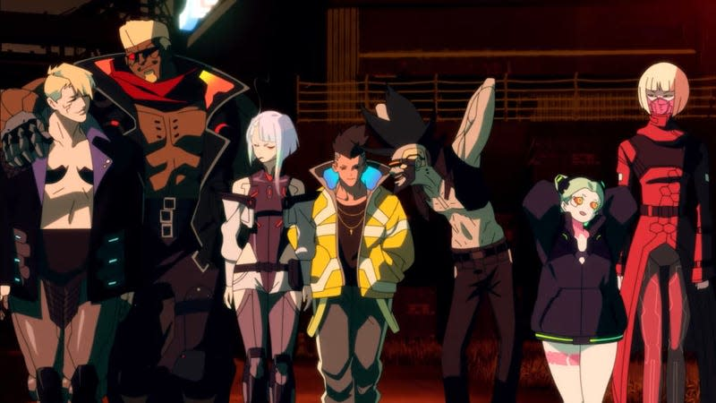
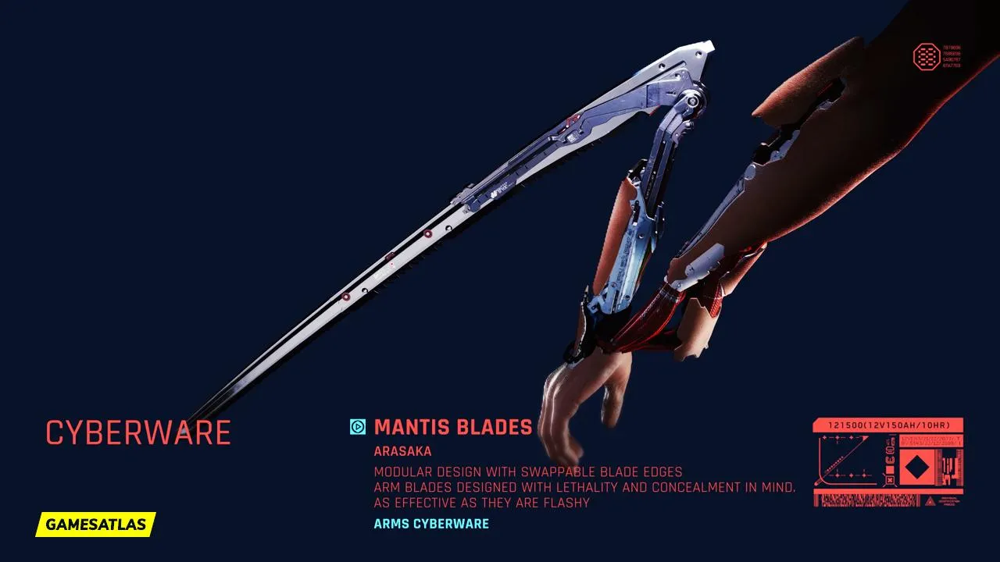
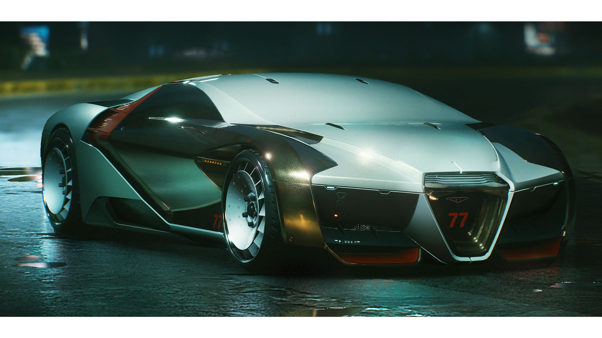

# Material Culture

The material world of Cyberpunk is heavily inspired by a High Tech and Neon drive, inspired in part by Japanese
city culture.

---

Night City, California. The bright neon lights of the city featuring a predominantly cyan and pink color scheme paint
the skyline, with corporate advertising scaling skyscrapers hundreds of stories tall.

---

The cast of the Cyberpunk Show: __Cyperpunk: Edgerunners__. The clothing on the characters shows a 
largely body positive look for clothing, with clothing for all genders being either fairly tight and revealing,
or large and baggy. All characters wear bright and colorful clothing as well, keeping with the theme of the city.

---

A piece of Cyberware from the Cyberpunk 2077 game. This military grade cyberware produced by the company Arasaka
is installed in the arm, able to be concealed within the arm.

---

A drivable car from the video game Cyberpunk 2077. The car retains a sleek appearance similar to that of a 2015 Bugatti
Veyron.

---

The El Coyote Cojo Bar from the game Cyberpunk 2077. Bar and Club city life is very popular within the year 2077, serving
as a legal escape from the harshness of the outside world for many people victimized by the corporate corruption.
