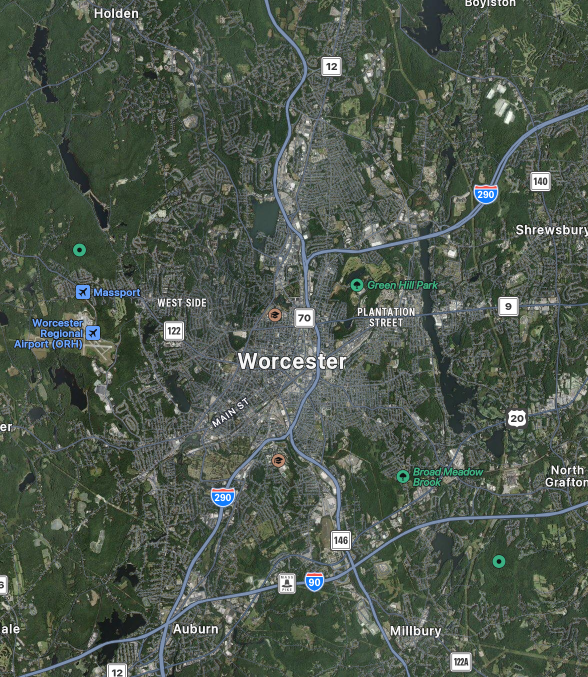

# Worcester Massachusetts, 2077

Worcester, 2025

## History

Due to internal corruption and divisiveness within the Northeast territories after a U.S. civilian government control,
the population of the [Northeast territories](https://cyberpunk.fandom.com/wiki/Northeast) has been rapidly declining. 
New York and the Boston Metropolitan area saw a rapid decline in the populations, 
especially due to unregulated oil spilling. Due to not wanting to populate the coastal cities, Worcester saw a large
boom in population from people evacuating New York City and Boston Metropolis without being able to migrate far.

Because the poorer population from both cities were the predominant grouping moving into Worcester, it saw a large
increase in street violence, drug and alcohol abuse, and homelessness within the southern districts of the city. 
While Worcester did not become a major metropolitan area, 
it did retain its status as a major city in the New England Territories.

The city retained its large dichotomy between its north and south ends, with the north end being for larger corporate
business, skyscrapers, and industrialization, and the south end being overrun with gang violence and illegal activity.

---
## Geography

Worcester is located in central Massachusetts, New United States of America. 
It is the County Seat of Worcester County.
Locationally, it is overshadowed by the Boston Metropolis. 

---
## Demographics

As said in the project introduction, Worcester houses a near 50% White population, with a large portion of the remaining
half of the city's population being either Black or Latino as of July 2023. As well, 76.6% of people speak another 
language besides English. 

Due to [population trends](https://worcestercountyinsights.org/demographics%20and%20diversity/change-in-population-by-race-ethnicity?rc=1) 
over the past decade, it is expected that the amount of racial minorities will continue to grow by the year 2077. 

The same situation can be found with the queer population of Worcester. As of 2025, an estimated 5% of the Worcester
population identifies within the LTBTQ+ community.
However, the percentage of people identifying as queer is increasing \with 28% of people ages 18-24 identifying
themselves as queer.
Assuming these trends continue with an inevitable plateau, it could be assumed Worcester will sustain a queer population
in its future, especially with the leftist support the city has.

---
## Economy

The world of Cyberpunk uses a currency known as the "European Currency Unit," commonly referred to as the "Eurodollar"
for short. This is the main central currency of both Europe and North America. The New United States has continued to
maintain the U.S. dollar, which has now depreciated in value with the use of holographic currency.The U.S. Dollar only
has about half the spending power of the Eurodollar.

---
## Government

The New United States retained its three branch government. Worcester also maintains its [Plan-E governing system](https://www.wrrb.org/wp-content/uploads/2023/10/Understanding-Worcesters-Charter-23_10.pdf),
electing both a City Council and a City Manager elected by the council. The Mayor of Worcester exists
predominantly as a symbolic figure, however they do oversee the City Council's activities.

During the 2020s, under the dictatorial Presidency of [Elizabeth Kress](https://cyberpunk.fandom.com/wiki/Elizabeth_Kress), 
Worcester did not hold new elections for City Council. 
This opened up a larger weakness through the city as the larger migration of people from the New York City and Boston
areas occured, however due to the experience of the members on the council at the time, the corruption of the City Council
did not prove to be a large threat, only exposing to a short term corruption concern.

Worcester returned to its regular election schedule in 2048, slightly before the resignation of Elizabeth Kress, due
largely in part due to protests within the city for new leadership.

---
## Education

Education is an important facet of Worcester Life. Worcester Polytechnic Institute 
(later rebranded to Worcester Institute of Technology (WIT) to advertise their more hands on research driven program) 
became a dominant school for young New Englander's in the 2010s. The school saw a small drop in attendance due to the
danger associated with living in the City throughout the 2020s.

WIT would reblossom into a highly regarded school for corporate [Ripperdocs](key-systems/ripperdocs.md) to graduate from,
however the school population would also be known for performing underground cyberware operations off campus for extra practice.
This resulted in a small population of cyberjunkies who will remain near WIT campus looking for their next installation.

Several companies in the northern end of Worcester also sponsor prestigious vocational schools and colleges, preparing
teens and young adults to be able to enter the corporate world soon after their graduation.
